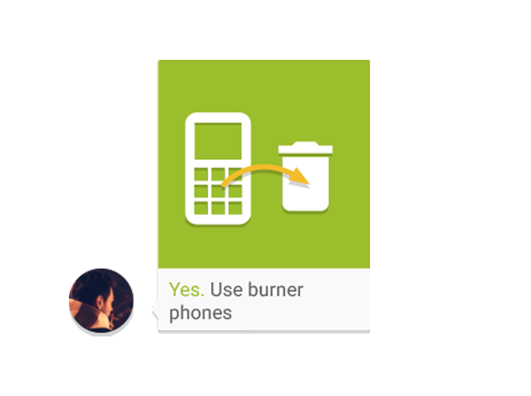

# Change your number.

Changing phones and numbers frequently makes your communications harder to recognise. A burner phone that is used temporarily and then discarded may help avoid surveillance.

# Limitations.

## Swapping SIM cards is not enough. 

The service knows which SIM cards have been used in which devices, and can track either individually or both together.

## Advanced location tracking may expose burner phones. 

Analysts may see when two devices move together or are used in the same location, even at different times.

## Calling patterns are distinctive. 

You might be the only person who calls both your relative and your colleague. You can change your device, but your activity may still be unique. 

## You may be recognised

Physical surveillance of the place where the phone is sold or used, or voice recognition, could reveal your identity. 

# Do:

*	Use prepaid phones (not associated with a personal credit card or bank account);
*	Avoid registering the phone or SIM cards if possible. 

*Note: in some countries there are legal or practical obstacles to obtaining anonymous mobile phone service.*

# Don't:

*   Reuse SIM cards or devices;
*   Carry different devices together;
*   Associate devices by using them in the same places;
*   Communicate with the same people.