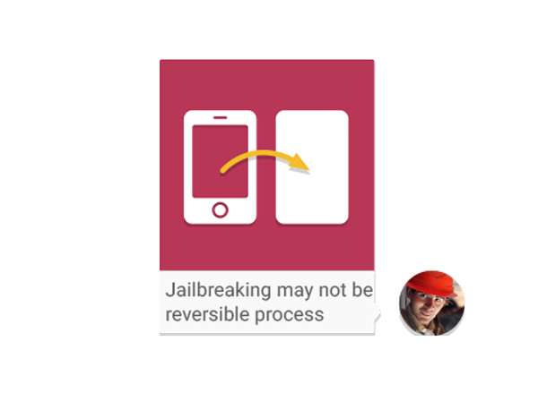

# Experts only

Firmware is the permanent software that a manufacturer programmes into a device's read-only memory. They run in cooperation with the device's operating system and are responsible for basic operations of the hardware of your smartphone, such as the speaker, microphone, cameras, touchscreen, memory, keys, antennas, etc. Most functionalities are 'locked in' so the user is not capable of controlling or altering these functions. There are however, some applications and functionalities that can enhance the security of data and communications on a smartphone. Also there are some other existing functionalities that can be removed to avoid security risks.

For this, and other reasons, some smartphone users choose to alter the programs running the smartphone. The process of overcoming these manufacturer imposed limits on a smartphone is called rooting (in case of Android devices), or jailbreaking (in case of iOS devices, like iPhone or iPad). Successful rooting or jailbreaking will enable you to install additional applications, make modifications, and give you total control over data storage and memory of the smartphone in order to make it more secure.

_WARNING:_ Rooting or jailbreaking may not be a reversible process, and it requires experience with software installation and configuration. Consider the following:

*   There is a risk of making your smartphone permanently inoperable, or 'bricking' it (i.e. turning it into a 'brick').
*   The manufacturer or mobile carrier warranty may be voided.
*   In some places, this process maybe illegal.

But if you are careful, a rooted device is a straightforward way to gain more control over your smartphone to make it much more secure.

Rooting or jailbreaking is a complex process and different for every device. Search the internet for instructions on the best way to root your own device.