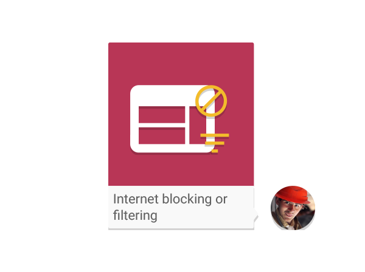

# How To Circumvent Online Censorship

Many governments, companies, schools, and public access points use software to prevent Internet users from accessing certain websites and Internet services. This is called Internet filtering or blocking and is a form of censorship. Content filtering comes in different forms. Sometimes entire websites are blocked and sometimes content is blocked based on keywords contained in it. One country might block Facebook entirely, or only block particular Facebook group pages-or it might block any page or web search with certain words in it.

Regardless of how content is filtered or blocked, you can almost always get the information you need by using a circumvention tool. Circumvention tools usually work by diverting your web or other traffic through another computer, so that it bypasses the machines conducting the censorship. 

There are different ways of circumventing Internet censorship, some of which provide additional layers of security that you may need. The tool that is most appropriate for you depends on your threat model. If you're not sure what your threat model is, you should work it out using the [Managing Information lesson](umbrella://lesson/managing-information). Users with a high threat model who need to ensure total anonymity online should use tools outlined in the Advanced section of this lesson.