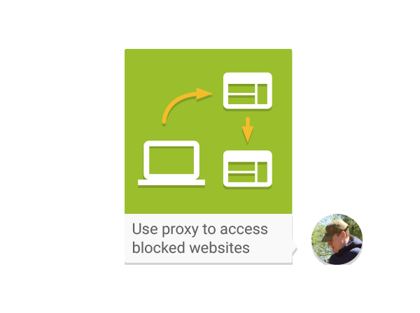

# Simple circumvention

A web-based proxy is a website that lets you access other websites from another location. 

If a website is blocked in your location, a proxy helps you access it from the proxy's location. 

Find examples at [proxy.org](https://proxy.org/).

## To use a proxy:

1. Enter the URL or web address you wish to view on the proxy webpage; 
2. The proxy displays the content.

## What web-based proxies lack

*	**Security:** Many are insecure, especially if someone is monitoring your connection.
*   **Privacy:** Proxies can see what you do online and may store information about you.
*	**Performance:** Many do not display pages correctly, especially complex websites, audio and video.
*   **Options:** Proxies work for websites, but not services like email. 

## Encrypted proxies 

Some proxy tools offer encrypted connections, or at least use HTTPS. But the proxy provider can still see what you do online, and store information about you. 

*Proxies do not provide anonymity.*

(Learn to stay anonymous online in [Internet Advanced] (umbrella://lesson/the-internet/1).)