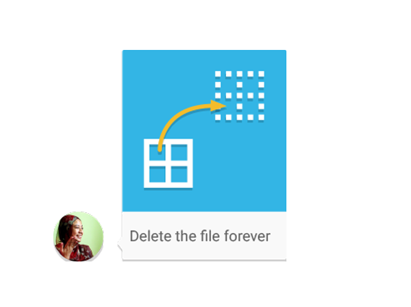

# Do you know where your data is? 

To create a backup policy, start with a four-column table.  

## Column 1: Information type. 

Consider: 

*   Email.
*   Documents. 
*	Chat history and important text messages.
*   Contacts and address books.
*   Publications.
*   Paper notebooks, diaries and letters.

## Column 2: Storage device.

Consider: 

* Computers, phones, and other devices.
* Remote servers operated by email or cloud storage providers.
* USB sticks, portable hard drives, SD cards, or CD-ROMs.
* Websites.
* Filing cabinets. 

## Column 3: Device location.

Consider: 

* Home.
* Work.
* Online. 
* With you. 

## Column 4: Master or duplicate?

Identify master copies, generally the most up-to-date version (this is the one to back up), or duplicates.

# Identify your weakness.

Which files could you access if your primary computer crashed or your phone was stolen? 

Information stored on one device or in one location is vulnerable.

