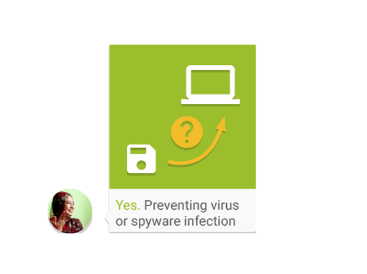

#  Use free, open-source software

Free, open-source software is often written and updated for free by volunteers and non-profit organisations. 

## Actively reviewed open-source tools are generally more secure than their proprietary alternatives:

* 	Open-source code can be examined by experts, who can also contribute solutions to problems.
* 	Common malware targets the most widely used software, which is often proprietary. 

## Consider replacing: 

* 	Internet Explorer with Firefox;
* 	Outlook with Thunderbird;
* 	Microsoft Office with LibreOffice; 
* 	Windows with Ubuntu.

In Mozilla Firefox, the [NoScript] (https://noscript.net/) add-on may help you avoid potentially dangerous [scripts] (https://securityinabox.org/en/guide/firefox/windows/#noscript). 
   
