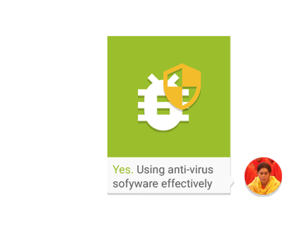

Follow these tips when using anti-virus software. 

(For an introduction to anti-virus software and some examples, see [Malware Beginner] (umbrella://lesson/malware/0).)

## Uninstall one anti-virus program before installing another.

Do not run two anti-virus programs at the same time. This might cause your computer to run extremely slowly or to crash. (However, anti-malware software is designed to work alongside anti-virus software.)

## Run the latest version and make sure it will update automatically. 

Without updates, anti-virus software can quickly become ineffective.

## Enable the 'always on' virus-detection feature. 

If your software has one, it may also be called 'Realtime Protection,' 'Resident Protection,' or something similar.

## Scan your computer regularly. 

Some tools do this automatically, but additional scans may be necessary in some cases: 

* 	Have you connected your computer to unknown networks recently? 
* 	Do you share USB memory sticks or use them on different computers? 
* 	Do you frequently receive attachments by email? 
* 	Has someone else in your home or office recently had virus problems? 

