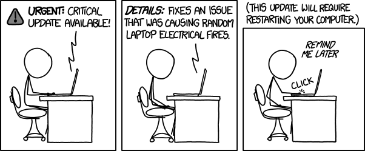
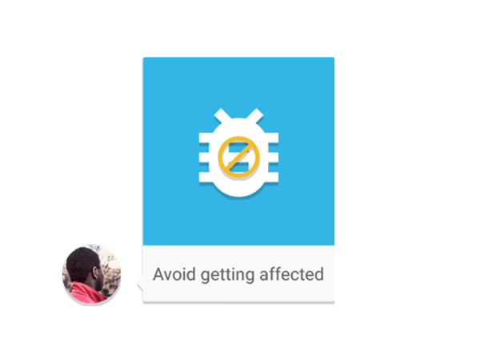

## Update, update, update. 

*   Run the latest available version of all software.
* 	Download new security patches immediately.
*   Only download software from official sites.
* 	Only download software from sites with https:// (not http://) at the start of the web address (the "s" stands for "secure"). 

*Some people think users with an unregistered copy of Windows should not accept security updates. This is not true.* 

##  Email

*   Don't click on suspicious attachments or links.  
*   In Gmail, open unusual attachments in Google Drive.
*	Download attachments and open them through the file menu of the relevant application (like Word).
*   Check unexpected emails by contacting the sender through another channel. 

(See the [phishing] (umbrella://lesson/phishing) lesson for more tips.)

## Online

*   Watch for browser windows that appear automatically, and read them carefully. 
* 	Close pop-up windows by clicking X in the upper corner, rather than by clicking inside the window.
*	Hover over URLs and hyperlinks to check where they lead. 
*	Check URLs at [VirusTotal](https://www.virustotal.com/#url).
*   Disconnect your computer from the Internet when not in use and overnight.

## On your computer 

* Disable 'AutoPlay' for USB sticks and other removable media. 
* Uninstall any software that you do not use, especially on a device you use for sensitive work. 

