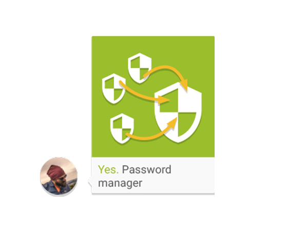

# Use a password manager

You know how to [create a strong password] (umbrella://lesson/passwords/0). But creating a different password for every account and changing it every few months makes it difficult to remember them all. 

Fortunately, there are tools to help. 

## A password manager can: 

* Generate random, secure passwords for each of your accounts;
* Record them in a portable, encrypted password database; 
* Protect all of your passwords with a single master password so you only have to remember one thing. 

Whenever you need to enter a password for a specific account, you can look it up using your master password. 

**This makes it especially important that you create and remember a very secure master password.** 

## KeePassXC

KeePassXC is a free, open-source password manager.

It works:

* On your desktop. 
* On a USB memory stick so you can look up a password while you are away from your primary computer. 
* With a web browser extension so you can quickly save or auto-fill passwords on the web. 

Learn how to install and use [KeepassXC](umbrella://lesson/keepassxc).

*Note: There are a number of programs with names similar to KeePassXC, like KeePassX, KeePass, and KeePass2. Some of these are based on the same code, while others just use the same database format. [KeePassXC](https://keepassxc.org/) is cross-platform and more actively developed.*