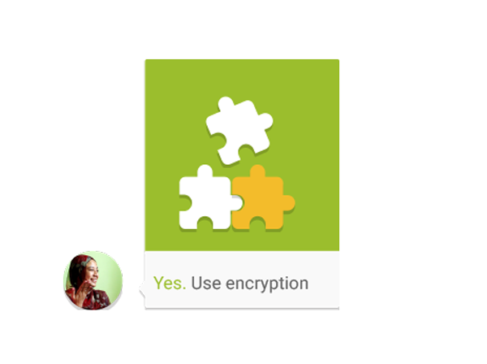

# Why protect your files? 

## Many people have sensitive information to protect from an adversary. 

(Learn to identify your adversary in the [managing information](umbrella://lesson/managing-information) lesson.) 

The [Malware](umbrella://lesson/malware) and [Passwords](umbrella://lesson/passwords/0) lessons will help you to protect your device and your accounts from attack. 

However, these precautions may fail, or you may be required to undermine them. 

(Learn about threats and password demands in [Passwords Expert](umbrella://lesson/passwords/2).) 

This is why you should also protect the files themselves. You can do this by encrypting files so that only you can read them.

# Encryption 

## Encryption enhances security by scrambling content. 

Only someone who has the right key can unscramble it. 

VeraCrypt is a free, open-source tool to encrypt files. VeraCrypt creates an encrypted container like a safe on your hard drive. You can keep as many files as you like in the container, and even hide it.  

This lesson introduces VeraCrypt. (For step by step instructions, see the [VeraCrypt] (umbrella://lesson/veracrypt) tool guide.)

*Note: Vulnerabilities have been found in TrueCrypt, an earlier version of VeraCrypt that is no longer maintained. Use VeraCrypt instead.*

