Signal for Android
==============================
Secure Messages 

**Lesson to read: [Sending a message] (umbrella://lesson/sending-a-message)**  
**Level**: Beginner-Intermediate  
**Time required**: 15-20 minutes  
**Published:** April 2018  (some images date from earlier versions)  
**Sources:** EFF, Surveillance Self-Defense [How to: Use Signal for Android] (https://ssd.eff.org/en/module/how-use-signal-android); Security in a Box [SIGNAL FOR ANDROID] (https://securityinabox.org/en/guide/signal/android/).

**Using Signal will give you:**

- The ability to send end-to-end encrypted group, text, picture, and video messages, and have encrypted phone conversations with other Signal users. 

**Download location**: The [Google Play store](https://play.google.com/store/apps/details?id=org.thoughtcrime.securesms).

**System requirements**: Android 2.3 and up, with Google Play Services (you need to have a Google account which will be linked to the installation of the app).

**Version used in this guide**: Signal 3.31.3

**License:** GPLv3

**Other reading**:

*   [http://support.whispersystems.org/](http://support.whispersystems.org/)
*   [https://signal.org/blog/standalone-signal-desktop/](https://signal.org/blog/standalone-signal-desktop/)
*   [https://whispersystems.org/blog/signal-video-calls/](https://whispersystems.org/blog/signal-video-calls/)

Introduction 
-----------------
Signal is a free and open source software application for Android, iOS, and Desktop that employs end-to-end encryption, allowing users to send end-to-end encrypted group, text, picture, and video messages, and have encrypted phone conversations between Signal users.  

Although Signal uses telephone numbers as contacts, encrypted calls and messages actually use your data connection; therefore both parties to the conversation must have Internet access on their mobile devices. Due to this, Signal users don’t incur SMS and MMS fees for these type of conversations. 

On Android, Signal can replace your default text messaging application, so within Signal it is still possible to send unencrypted SMS messages.

Note:  
* Signal prevents others from accessing the content of your messages and voice calls, but it does not hide the fact that you are sending encrypted messages or making encrypted voice calls. In some countries, encryption tools like Signal might attract attention or violate legal constraints.  
* Open Whisper Systems, the makers of Signal, use other companies' infrastructure (Google on Android) to send its users alerts when they receive a new message. That means some metadata, or information about who is receiving messages and when they were received, may leak to these companies.

Installing Signal on your Android phone 
----------------------------------------
### Step 1: Download and Install Signal

On your Android device, enter the Google Play store and search for “Signal.” Select [Signal by Open Whisper Systems](https://play.google.com/store/apps/details?id=org.thoughtcrime.securesms).

After you tap “Install,” you’ll see a list of Android functions that Signal needs to be able to access in order to function. Click “Accept.”

After Signal has finished downloading, tap “Open” to launch the app.

### Step 2: Register and Verify your Phone Number

You will now see the following screen. Enter your mobile phone number and tap “Register.”

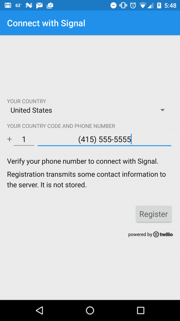

You will then be asked to verify your phone number. Click "Continue."

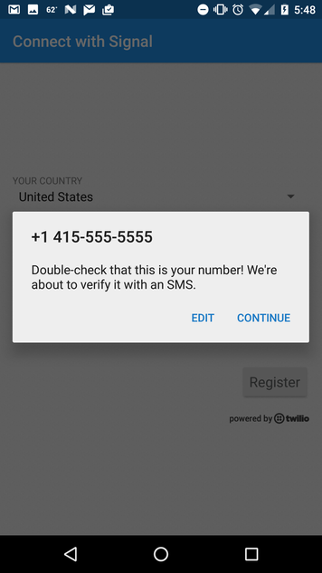

In order to verify your phone number, you will be sent an SMS text with a six-digit code. Since Signal can access your SMS text messages, it will automatically recognize when you’ve received the code and complete your registration.

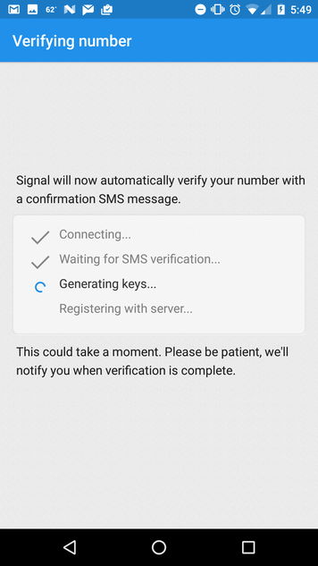

After this process is complete, you'll be asked if you want Signal to be your default SMS app. This can be useful to keep all your messages in one place. Be aware that if you accept this, messages sent to contacts that do not have Signal installed (even if you send them from within the Signal app) will not be encrypted.

 

Using Signal
------------------------------

In order to use Signal, the person that you are calling must have Signal installed. If you try to send a message to someone using the Signal app and they do not have Signal installed, it will send a standard, non-encrypted text message. If you try to call the person, it will place a standard phone call.

Signal provides you with a list of other Signal users in your contacts. To do this, data representing the phone numbers in your contact list is uploaded to the Signal servers, although this data is deleted almost immediately.

### How to Send an Encrypted Message

Tap the pencil icon in the lower-right corner of the screen.

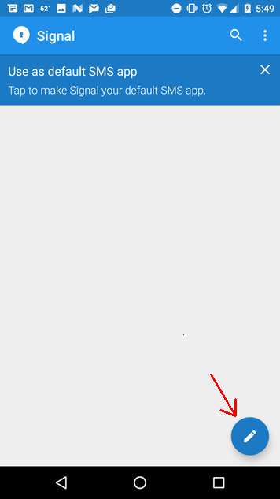

You will see a list of all the registered Signal users in your contacts. You can also enter the phone number of a Signal user who isn’t in your contacts. When you select a contact, you'll be brought to the text-messaging screen for your contact. Note that for Signal users, you'll see the text "Send Signal Message" - this means that the message will be encrypted. On this screen, the "phone" icon in the upper right corner of the screen will indicate that you can make an encrypted voice call using Signal as well. From this screen, you can send end-to-end encrypted text, picture, or video messages.

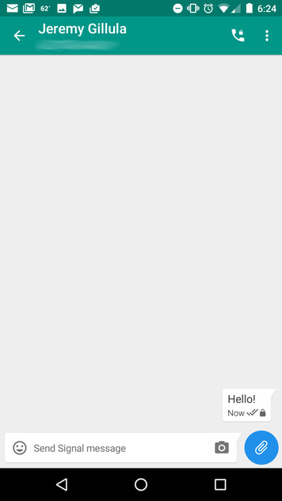

For users that do not have Signal installed, you'll see the text "Send unsecured SMS", which will not send the message with encryption. On this screen, the "phone" icon in the upper right corner of the screen will make a regular, unencrypted phone call.

### How to Initiate an Encrypted Call

To initiate an encrypted call to a contact, select that contact and then tap on the phone icon. You’ll know that the contact can accept Signal calls if you see a small padlock icon next to the phone icon.

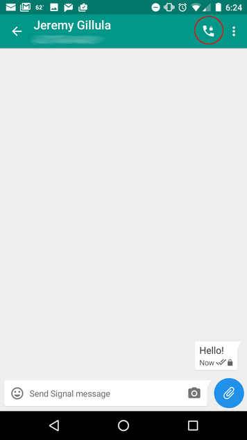

Once a call is established, your call is encrypted.

### How to Initiate an Encrypted Video Call

To make an encrypted video call, simply call someone as described above:

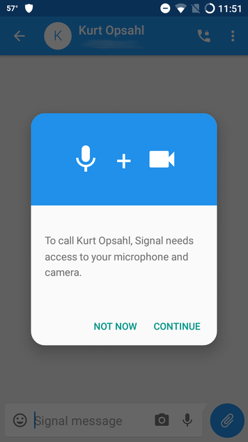

and tap the video camera icon. You may have to allow Signal to access video from your camera. This shares your video with your friend (your friend may have to do the same).

### How to Start an Encrypted Group Chat

You can send an encrypted group message by tapping the overflow icon (the three dots in the upper-right corner of the screen) and selecting “New group.”

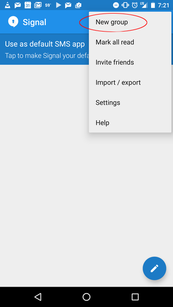

On the following screen, you'll be able to name the group and add participants to it.

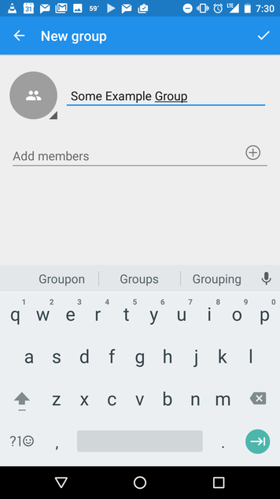

After adding participants, you can tap on the check mark in the upper right corner of the screen. This will initiate the group chat.

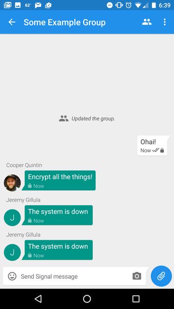

If you wish to change the group icon, add, or remove participants, this can be done from the group chat screen by tapping the overflow icon (the three dots in the upper-right corner of the screen) and selecting “Update group.”

### Mute Conversations

Sometimes conversations can be distracting. One feature that is especially useful for group chats is muting notifications, so you don't see a new notification every time a new message is made. This can be done from the group chat screen by tapping the overflow icon (the three dots in the upper-right corner of the screen) and selecting “Mute notifications.” You can then select how long you'd like the mute to be active for. This can be applied to individual conversations as well, if desired.

### How to Verify your Contacts

At this point, you can verify the authenticity of the person you are talking with, to ensure that their encryption key wasn't tampered with or replaced with the key of someone else when your application downloaded it (a process called key verification). Verifying is a process that takes place when you are physically in the presence of the person you are talking with.

First, open the screen where you are able to message your contact, as described above. From this screen, tap the overflow icon (the three dots in the upper-right corner of the screen) and select "Conversation settings."

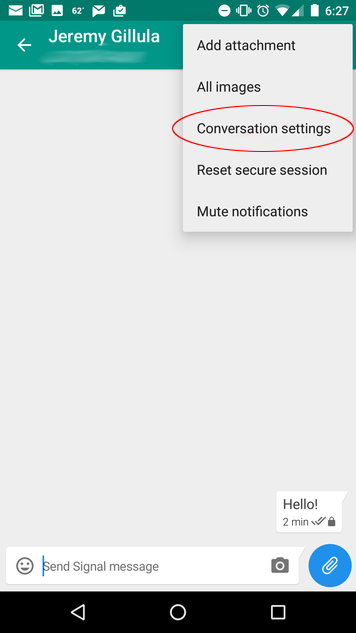

From the following screen, tap "Verify safety numbers."

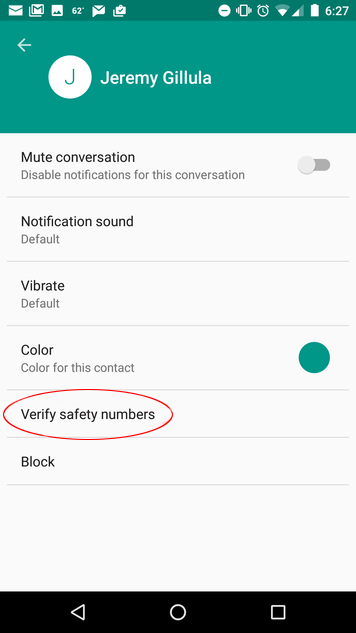

You will now be brought to a screen which displays a QR code and a list of "safety numbers." This code will be unique for every different contact you are conversing with. Have your contact navigate to the corresponding screen for their conversation with you, so that they have a QR code displayed on their screen as well.

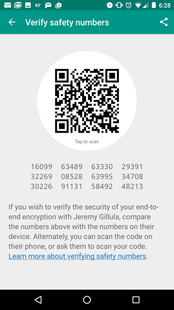

Back on your device, you can tap on your QR code, which will use the camera to scan the QR code that is displayed on your contact's screen. Align your camera to the QR code:

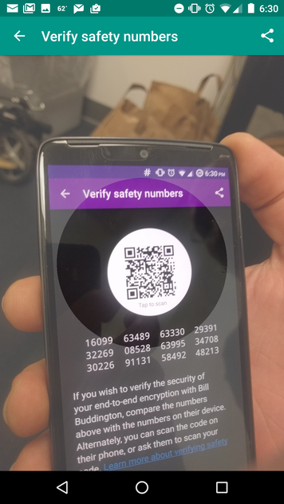

Hopefully, your camera will scan the barcode and display a check mark, like this:

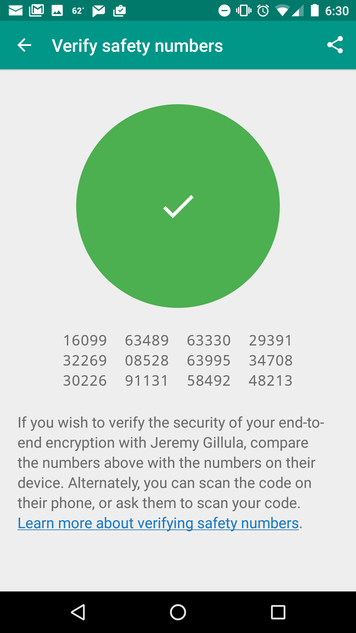

This indicates that you have verified your contact successfully. If instead your screen looks like this, something has gone wrong:

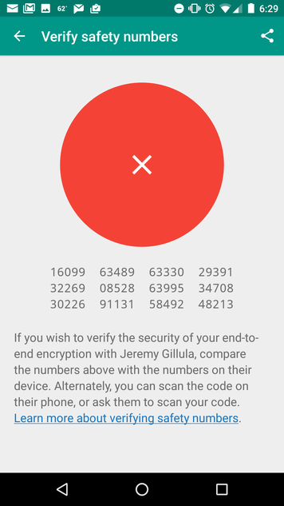

You may want to avoid discussing sensitive topics until you have verified keys with that person.

_Note for power users: The screen displaying your QR code also has an icon to share your safety number in the top-right corner. In-person verification is the preferred method, but you may have already authenticated your contact using another secure application, such as PGP. Since you've already verified your contact, you can safely use the trust established in that application to verify safety numbers within Signal, without having to be physically in the presence of your contact. In this case you can share your safety number with that application by tapping the "share" icon, and send your contact your safety number._

### Disappearing Messages

Signal has a feature called disappearing messages which ensures that messages will be removed from your device and the device of your contact some chosen amount of time after they are seen. To enable disappearing messages for a conversation, open the screen where you are able to message your contact. From this screen, tap the overflow icon (the three dots in the upper-right corner of the screen) and select "Disappearing messages."

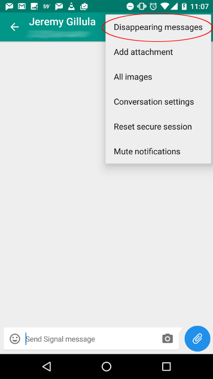

A new screen will appear that allows you to choose how quickly messages will disappear:

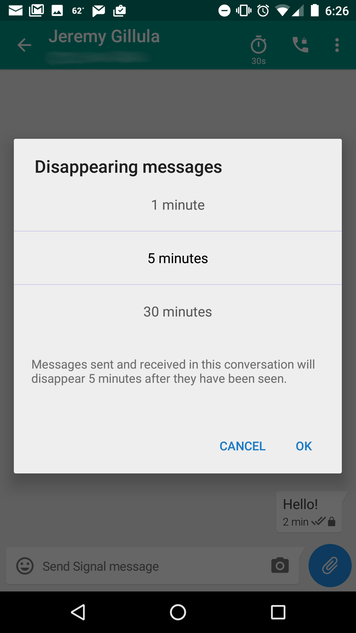

After you select an option, you should see information in the conversation indicating that "disappearing messages" have been enabled.

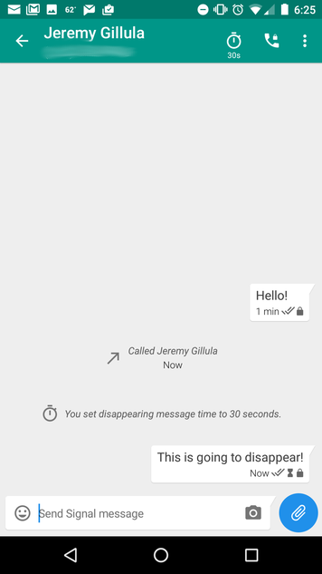

You can now send messages with the assurance that they will be removed after the chosen amount of time.