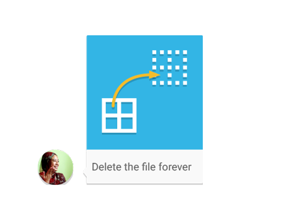

Choose a storage device.

## USB sticks or external hard drives.

* Inexpensive, large capacity, easy to overwrite numerous times. 
* USB sticks have a lifetime of approximately ten years; external hard drives last longer.

## CDs or DVDs. 

* CDs store around 700 MB of data, DVDs up to 4.7 GB. 
* You will need a CD or DVD burner and blank discs, or a CD-RW or DVD-RW burner and rewritable CDs to erase or update discs. 
* Many operating systems can write files to CDs and DVDs, though Apple no longer sells a Mac with a CD/DVD drive. 
* Discs may begin to deteriorate after five or ten years.

## Remote server

* A well-maintained network backup server may have almost unlimited capacity. 
* The speed and stability of your own Internet connection will determine whether this is a realistic back up option. 
* Consider the risks of putting your information online. 
* Always encrypt backups before uploading them to servers run by organisations or individuals you do not know and trust.

*Note: Running a backup server in your office violates the requirement that you store copies of important data in different locations.*  
