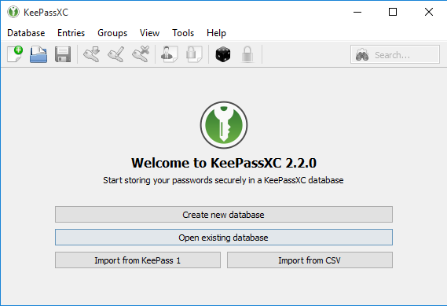
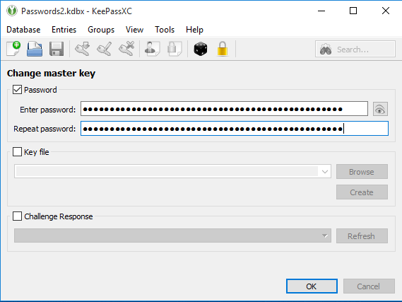
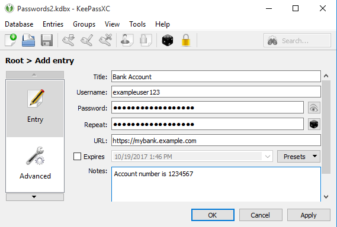
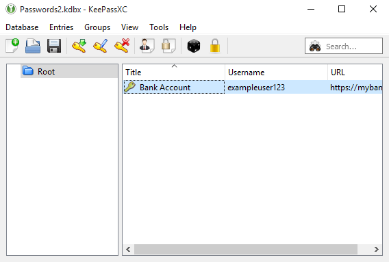
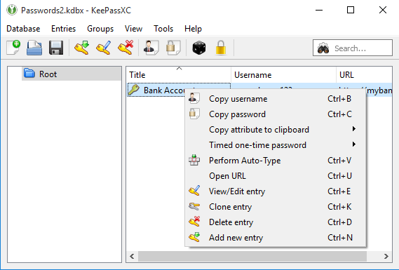
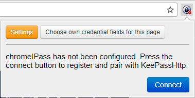
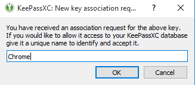

KeePassXC
=====================

Secure Password Manager

**Lesson to read: [Passwords](umbrella://lesson/passwords/1).**  
**Level**: Beginner  
**Time required**: 5 minutes to setup for a lifetime of blissful strong password usage.  
**Published:** April 2018    
**Sources:** Surveillance Self-Defense (EFF), [How to: Use KeePassXC] (https://ssd.eff.org/en/module/how-use-keepassxc); [https://github.com/keepassxreboot/keepassxc/wiki](https://github.com/keepassxreboot/keepassxc/wiki). 

**Using KeepassXC will give you:**  
* The ability to use many different passwords on different sites and services without having to memorize them.

**Download location:** For Windows/Mac/Linux: [https://keepassxc.org/download](https://keepassxc.org/download)  
**Computer requirements:** Windows 7 or higher, MacOS X 10.7 or higher, Linux (most distros)  
**Version used in this guide**: KeePassXC 2.2.0 (KeePassXC is a cross-platform version of the Windows-only KeePass program.)  
**License**: FOSS (primarily GPLv2)

Introduction 
----------------------------------------------------------------

KeePassXC is a cross-platform password manager that allows you to store all of your passwords in one location. A password manager is a tool that creates and stores passwords for you, so you can use many different passwords on different sites and services without having to memorize them. You only need to remember one master password that allows you to access the encrypted password manager database of all your passwords.

_There are a number of programs with names similar to KeePassXC, like KeePassX, KeePass, and KeePass2. Some of these are based on the same code, while others just use the same database format. This guide recommends_ [_KeePassXC_](https://keepassxc.org/) _because it is cross-platform and more actively developed than some of the alternatives._

Note: Using a password manager creates a single point of failure and establishes an obvious target for bad actors or adversaries. Research suggests that many commonly used passwords managers have vulnerabilities, so use caution when determining whether or not this is the right tool for you.

How KeePassXC works 
-------------------------------------

KeePassXC works with password databases, which are files that store a list of all your passwords. These databases are encrypted when they are stored on your computer’s hard disk. So, if your computer is off and someone steals it, they will not be able to read your passwords.

Password databases can be encrypted using a master password. Since your master password protects all your other passwords, you should make it as strong as possible. (Learn how to create strong [Passwords](umbrella://lesson/passwords/0).)
 

Using a master password
---------------------------------------------------------------------------------------------------------------------------------------------------------------------------------------------------------------------------------

A master password acts like a key—in order to open the password database, you need the correct master password. Without it, nobody can see what’s inside the password database. When using a master password to secure your password database, here are a couple of things to keep in mind.

*   This password will decrypt all of your passwords, so it needs to be strong! It should be hard to guess and long. The longer it is, the less you need to worry about having special characters or capital letters or numbers. So make your master password a passphrase. A passphrase is a string of many words that are easy for you to remember but difficult for others to guess.
*   You can create a strong master passphrase [using regular, random words](https://www.eff.org/dice). These are easier to remember than unnatural combinations of symbols and capital letters. (Learn more about [Passwords](umbrella://lesson/passwords).)
  

Getting started with KeePassXC
------------------------------------------------

Install KeePassXC and launch it. Click on the File menu and select “Create new Database.” You will be prompted to save your password database. Note that you can move the password database file later to wherever you like on your hard disk, or move it to other computers—you will still be able to open it using KeePassXC and the password, or keyfile, you specified before.

**_What's a keyfile?_** _Using a keyfile in addition to your master password can make it harder for someone to decrypt your password database if they steal a copy. You can use any existing file as a keyfile—an image of your cat for example, could be used as a keyfile. You’ll just need to make sure the file you choose never gets modified, because if its contents are changed then it will no longer decrypt your password database. Sometimes opening a file in another program can be enough to modify it so don't open the file except to unlock KeePassXC. (It is safe to move or rename the keyfile, though.) Usually a strong master password is plenty on its own. If you choose to use a keyfile in addition to your master password, make sure to store it separately from your password database._

Next, a dialog box will pop up and ask you to enter a master password and/or use a keyfile. Select the appropriate checkbox(es) based on your choice.

If you want to see the password you’re typing in (instead of obscuring it with dots), click the button with the eye to the right.

 

Organizing passwords 
--------------------------------------

KeePassXC allows you to organize passwords into “Groups,” which are basically just folders. You can create, delete, or edit Groups or Subgroups by going to the “Groups” menu in the menubar, or by right-clicking on a Group in the left-hand pane of the KeePassXC window. Grouping passwords doesn’t affect any of the functionality of KeePassXC—it’s just a handy organizational tool.
 

Storing/generating/editing passwords
------------------------------------------------------

To create a new password or store a password you already have, right-click on the Group in which you want to store the password, and choose “Add New Entry.” (You can also choose “Entries > Add New Entry” from the menu bar.) For basic password usage:

*   Enter a descriptive title you can use to recognize the password entry in the “Title” field. For example, this could be the name of the website or service the password is for.
*   Enter the username associated with the password entry in the “Username” field. (If there is no username, leave this blank.)
*   Enter your password in the “Password” field. If you’re creating a new password, click on the dice icon to the right. You might want to do this when you are signing up for a new website, or when you are replacing older, weaker passwords with new, unique, random passphrases. ” After you click the dice icon, a password generator dialog will pop up. You can use this to generate a random password. There are several options in this dialog, including what sorts of characters to include and how long to make the password.
    *   Note that if you generate a random password, you don’t have to remember (or even know!) what that password is. KeePassXC stores it for you, and any time you need it you will be able to copy/paste it into the appropriate program. This is the whole point of a password manager—you can use different long random passwords for each website/service, without even knowing what the passwords are!
    *   Because of this, you should make the password as long as the service will allow and use as many different types of characters as possible.
*   Once you’re satisfied with the options, click “Generate” in the lower right to generate the password, and then click “OK.” The generated random password will automatically be entered in the “Password” and “Repeat” fields for you. (If you’re not generating a random password, then you’ll need to enter your chosen password again in the “Repeat” field.)
*   Click OK. Your password is now stored in your password database. To make sure the changes are saved, save the edited password database by going to “File > Save Database.” (Alternatively, if you made a mistake, you can close and then re-open the database file and all changes will be lost.)

If you need to change/edit the stored password, you can just choose its Group and then double-click on its title in the right-hand pane, and the “New Entry” dialog will pop up again.

Normal Use 
----------------------------

To use an entry in your password database, right-click on the entry and choose “Copy Username to Clipboard” or “Copy Password to Clipboard.” Go to the window/website where you want to enter your username/password, and paste it in the appropriate field. (Instead of right-clicking on the entry, you can also double-click on the username or password of the entry you want, and the username or password will be automatically copied to your clipboard.)

Other Features
--------------------------------

KeePassXC allows you to:

*   Search your database using the search box (the text box in the toolbar of the main KeePassXC window).
*   Sort your entries by clicking on the column header in the main window.
*   “Lock” KeePassXC by choosing “Tools > Lock Databases.” This allows you to leave KeePassXC open, but have it ask for your master password (and/or keyfile) before you can access your password  database again. You can also have KeePassXC automatically lock itself after a certain period of inactivity. This can prevent someone from accessing your passwords if you step away from your computer or lose it. To enable this feature on macOS, choose “Preferences > Settings” from the menu and click on the security options. Then check the box that says “Lock database after inactivity of \[number\] seconds.” For Linux or Windows, choose “Tools > Settings” from the menu and click on the security options. Then check the box that says “Lock database after inactivity of \[number\] seconds."
    

KeePassXC can also store more than just usernames and passwords. For example, you can create entries to store important things like account numbers, product keys, airline frequent flyer information, or serial numbers. There’s no requirement that the data you put in the “Password” field actually has to be a password. Just input what you want to store in the “Password” field instead of an actual password (and leave the “Username” field blank if there’s no username) and KeePassXC will safely and securely remember it for you.
 

How to install the browser extension
------------------------------------------------------

A browser extension is a software component that adds additional features to your web browser. Using the KeePassXC extension provides a convenient way for your browser and your KeePassXC application to communicate. This will allow you to quickly save or auto-fill passwords on the web.

In order to integrate KeePassXC in your browser you need to:

1.  Enable KeePassXC HTTP protocol
      
    Go to “Preferences > Settings” from the menu and click on the HTTP options. Then check the box that says “Enable KeePassXC HTTP protocol.” This allows KeePassXC and the browser extension to communicate.
    
2.  Download the browser extension  
      
    For Firefox, install [Passifox](https://addons.mozilla.org/en-US/firefox/addon/passifox/). For Chrome, install [chromeIPass](https://chrome.google.com/webstore/detail/chromeipass/ompiailgknfdndiefoaoiligalphfdae). After the installation is successful, you’ll see a small lock icon in your browser toolbar.  
      
    
    
3.  Connect the browser extension to KeePassXC
    
    In order for KeePassXC and your browser to communicate. you need to connect them by creating an association. While KeePassXC is running, open your browser and click on the KeePass extension icon. Click “Connect.”  
      
      
      
    This will bring up a “New key association dialog request” dialog. Give this association name a descriptive name, e.g. Chrome. Using a descriptive name helps you to identify this association in the future.  
      
    
    

Now that your browser is connected with KeePassXC, you’ll see this message when you click on the KeePass extension icon.

Using Autofill can be bad for your privacy. To disable it, uncheck the settings “Automatically fill-in single credentials entry” and “Activate autocomplete for username fields.”

You're all done! Now you can save any credentials you enter on the web. You will also be able to automatically fill in your usernames/passwords.

KeePassXC is easy-to-use, robust software, and we recommend exploring the program to learn all of the useful things it can do.